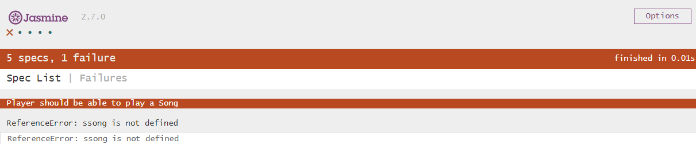

# **fe-with-tdd**

### **jasmine-sample-code**

\- 2.7.0 Release<br/>
<a href="https://github.com/jasmine/jasmine/releases">https://github.com/jasmine/jasmine/releases</a>


\- standalone 방식

\- TestRunner : SpecRunner.html

### jasmine sample 테스트러너 실행 결과


### **jasmine 문법**
<a href="https://jasmine.github.io/api/2.7/global.html#expect">API Document</a>

- describe : 스펙 그룹 (Test unit group)
- it : 단일 테스트 스펙 (Test unit)
- expect : matcher (검증용)
- beforeEach : describe 호출 전 설정 실행
- spyOn : 감시할 객체, 메소드

> ### 예제

**src/player.js**

``` js
function Player() {
}

Player.prototype.play = function(song) {
  this.currentlyPlayingSong = song;
  this.isPlaying = true;
};
```

**spec/PlayerSpec.js**

``` js
describe("Player", function() {
  var player;
  var song;

// 공통으로 사용할 내용 beforeEach에 정의
  beforeEach(function() {
    player = new Player(); // Player.js
    song = new Song();
  });

// it (Test description ,함수) 생성
  it("should be able to play a Song", function() {
    player.play(song);
    // 결과 값 : player.currentlyPlayingSong, 기대값 : song
    expect(player.currentlyPlayingSong).toEqual(song);
  });
  ...
});
```
> ### **jasmine sample 코드설명**
> Player라고 정의한 테스트 유닛들에서 공통으로 사용될 내용을 beforeEach에 정의한다.
it 함수를 이용하여 "should be able to play a Song" Test description과 Test function을 작성한다.
player는 Player.js 의 객체로 this.currentlyPlayingSong = song; 으로 정의되어 있으므로 expect의 기대값인 song과 실제 값인 player.currentlyPlayingSong이 동일하여 테스트가 성공한다.
성공이 아닌 케이스를 확인하고 싶다면 song을 다른 text로 변경해보면 다음과 같이 test fail 결과를 확인할 수 있다.

