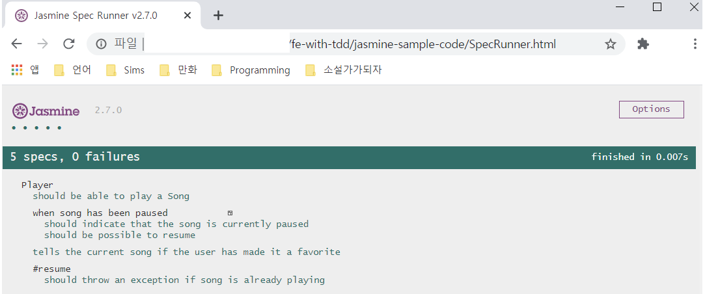

# fe-with-tdd

## <a href="https://github.com/jasmine/jasmine/releases">jasmine-sample-code</a>

\- 2.7.0 Release

\- standalone 방식

\- TestRunner : SpecRunner.html

> counter => <a href="https://github.com/jeonghwan-kim/lecture-develop-fe-with-tdd">lecture-develop-fe-with-tdd</a> 참고
